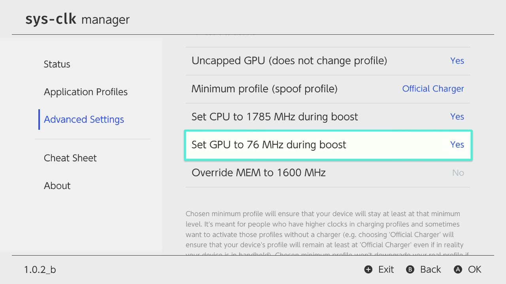
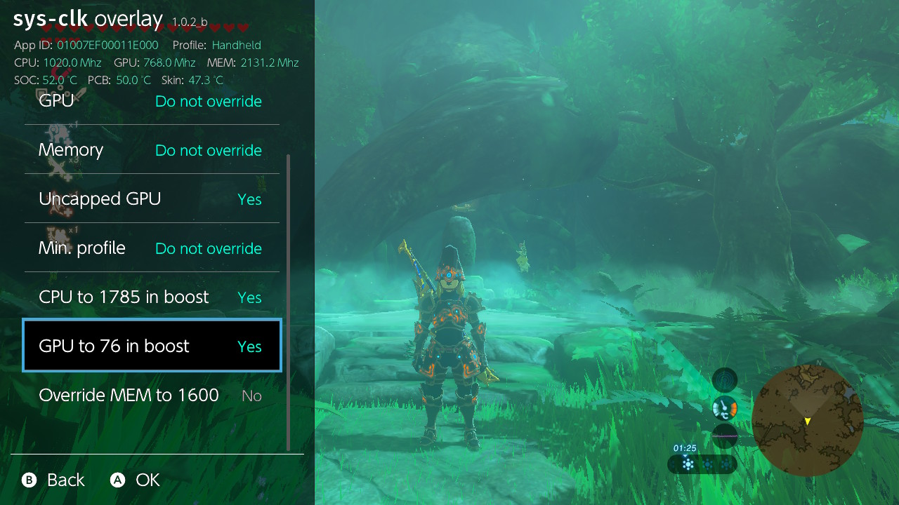
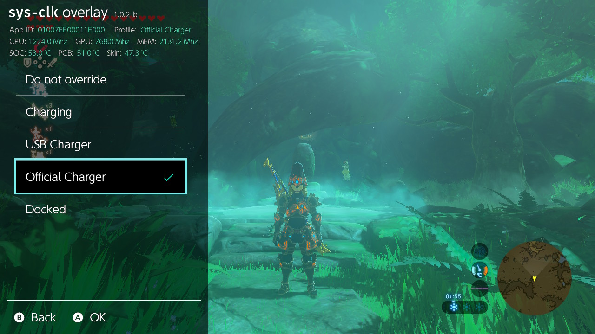
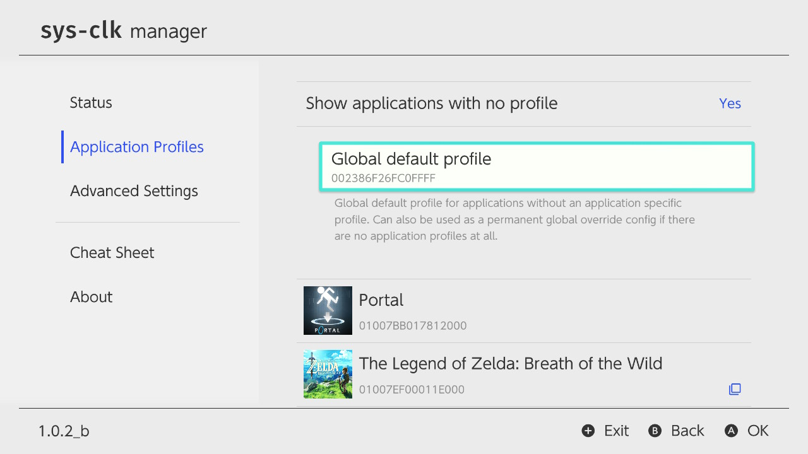

## Custom configurations

* Uncapped GPU (does not change profile)
    1. Use whatever GPU value you want, no connected charger needed.
    2. It doesn't change the profile, e.g without a charger you are still at profile 'Handheld'. If you need to change the profile without the requirement to connect a charger, use the setting 'Minimum profile'.
    3. Possible values: `Yes` or `No`.
    
* Minimum profile (spoof profile)
    1. Chosen minimum profile will ensure that your device will stay at least at that minimum level. 
    2. It's meant for people who have higher clocks in charging profiles and sometimes want to activate those profiles without a charger (e.g. choosing 'Official Charger' will ensure that your device's profile will remain at least at 'Official Charger' even if in reality your device is in handheld). 
    3. Chosen minimum profile won't downgrade your real profile if the real profile is higher than the minimum profile (e.g. when docked choosing 'Charging' doesn't do anything (you are already at a higher profile)).
    4. Possible values:
    `Do not override`,
    `Charging`,
    `USB Charger`,
    `Official Charger` or
    `Docked`.
    
* Set CPU to 1785 MHz during boost
    1. Let boost mode override sys-clk value set for CPU during boost mode with the default 1785 MHz.
    2. In most cases you want to enable this to get the best loading times. Don't enable if you want to use CPU clocks over 1785 MHz also during boost mode (you need to use a CPU patch to achieve this which most of people don't even have).
    3. Possible values: `Yes` or `No`.

* Set GPU to 76 MHz during boost
    1. Let boost mode override sys-clk value set for GPU during boost mode with the default 76 MHz.
    2. In most cases you want to enable this to get the best out of your battery life. 
    2. Possible values: `Yes` or `No`.

* Override MEM to 1600 MHz
    1. Permanently override MEM to 1600 MHz (or higher MEM clock achieved with patching).
    2. An easy way to use max memory clocks without doing application specific profiles or using the new global default profile. 
    2. Possible values: `Yes` or `No`.

* Global default profile
    1. A global default profile for applications without an application specific profile.
    2. Can also be used as a permanent global override config if there are no application profiles at all.
    2. Only accessible via sys-clk manager, always the first item in the application profile list, always visible in the list.
    
# sys-clk

Switch sysmodule allowing you to set cpu/gpu/mem clocks according to the running application and docked state.

## Installation

The following instructions assumes you have a Nintendo Switch running Atmosphère, updated to at least the latest stable version.
Copy the `atmosphere`, and `switch` folders at the root of your sdcard, overwriting files if prompted. Also copy the `config` folder if you're not updating, to include default settings.

**Note:** sys-clk-overlay requires to have [Tesla](https://gbatemp.net/threads/tesla-the-nintendo-switch-overlay-menu.557362/) installed and running

## Relevant files

* Config file allows one to set custom clocks per docked state and title id, described below

	`/config/sys-clk/config.ini`

* Log file where the logs are written if enabled

	`/config/sys-clk/log.txt`

* Log flag file enables log writing if file exists

	`/config/sys-clk/log.flag`

* CSV file where the title id, profile, clocks and temperatures are written if enabled

	`/config/sys-clk/context.csv`

* sys-clk manager app (accessible from the hbmenu)

	`/switch/sys-clk-manager.nro`

* sys-clk overlay (accessible from anywhere by invoking the [Tesla menu](https://gbatemp.net/threads/tesla-the-nintendo-switch-overlay-menu.557362/))

	`/switch/.overlays/sys-clk-overlay.ovl`
	
* sys-clk core sysmodule

	`/atmosphere/contents/00FF0000636C6BFF/exefs.nsp`
	`/atmosphere/contents/00FF0000636C6BFF/flags/boot2.flag`

## Config

Presets can be customized by adding them to the ini config file located at `/config/sys-clk/config.ini`, using the following template for each app 

```
[Application Title ID]
docked_cpu=
docked_gpu=
docked_mem=
handheld_charging_cpu=
handheld_charging_gpu=
handheld_charging_mem=
handheld_charging_usb_cpu=
handheld_charging_usb_gpu=
handheld_charging_usb_mem=
handheld_charging_official_cpu=
handheld_charging_official_gpu=
handheld_charging_official_mem=
handheld_cpu=
handheld_gpu=
handheld_mem=
```

* Replace `Application Title ID` with the title id of the game/application you're interested in customizing.
A list of games title id can be found in the [Switchbrew wiki](https://switchbrew.org/wiki/Title_list/Games).
* Frequencies are expressed in mhz, and will be scaled to the nearest possible values, described in the clock table below.
* If any key is omitted, value is empty or set to 0, it will be ignored, and stock clocks will apply.
* If charging, sys-clk will look for the frequencies in that order, picking the first found 
	1. Charger specific config (USB or Official) `handheld_charging_usb_X` or `handheld_charging_official_X`
	2. Non specific charging config `handheld_charging_X`
	3. Handheld config `handheld_X`

Running your switch at higher clocks than stock may cause instability, and is not recommended. a good refrence point is the normal CPU max clock 1785mhz, and the gpu to 921mhz, as well as the memory at 1600mhz.
Made with ❤️ by [Gcsman110]